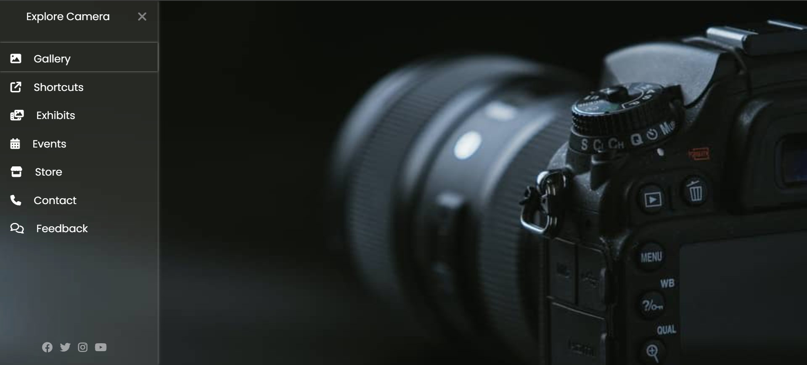

# CSS Project: Explore Camera

## Project Description
This is a simple web project that showcases a sidebar navigation menu with a modern design using HTML and CSS. The menu slides out when the hamburger icon is clicked and includes links to various sections like Gallery, Exhibits, Events, and more. The project is styled with custom CSS and uses the Font Awesome icon library for icons.

## Features
- **Responsive Sidebar Menu**: A collapsible sidebar that can be toggled with a hamburger icon.
- **Font Awesome Integration**: Icons used throughout the menu for easy navigation.
- **Social Media Links**: A section at the bottom of the sidebar for social media icons.
- **Poppins Font**: A clean and modern font applied throughout the webpage for better readability.
- **Background Image**: Full-screen background image to give the page a professional look.

## Screenshots

Here's a snapshot of website:

## Technologies Used
- **HTML5**
- **CSS3**
- **Font Awesome**
- **Google Fonts (Poppins)**

## How to Use
1. Clone or download the repository to your local machine.
2. Open the `index.html` file in your web browser to view the project.
3. Click on the hamburger icon in the top left corner to open the sidebar navigation menu.
4. Explore the different sections by clicking the links in the sidebar.

## Customization
You can customize this project by:
- Modifying the menu items in the `index.html` file.
- Changing the background image in the `style.css` file under the `.main_box` class.
- Adjusting the styling, such as colors and fonts, in the `style.css` file.

## File Structure
- `index.html` - The main HTML structure for the project.
- `style.css` - Contains the styling rules for the project, including the sidebar and general layout.
